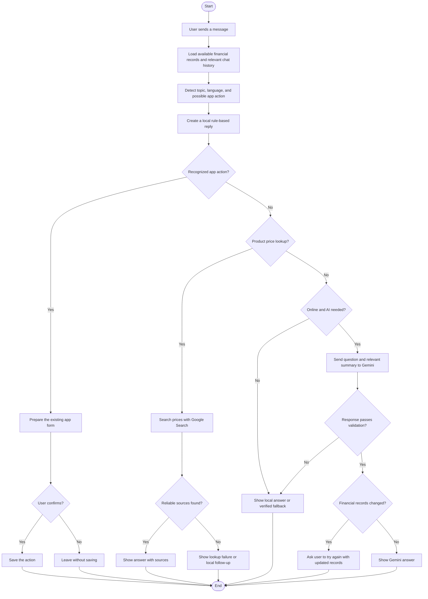
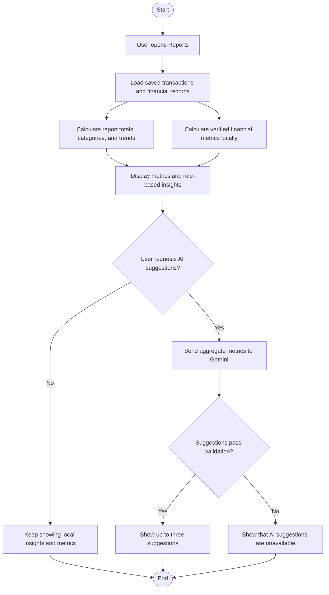

# AI Chatbot and Financial Insights Flowcharts

## AI Chatbot

```mermaid
flowchart TD
    A([Start]) --> B[User sends a message]
    B --> C[Load available financial records and relevant chat history]
    C --> D[Detect topic, language, and possible app action]
    D --> E[Create a local rule-based reply]

    E --> F{Recognized app action?}
    F -- Yes --> G[Prepare the existing app form]
    G --> H{User confirms?}
    H -- Yes --> I[Save the action]
    H -- No --> J[Leave without saving]
    I --> Z([End])
    J --> Z

    F -- No --> K{Product price lookup?}
    K -- Yes --> L[Search prices with Google Search]
    L --> M{Reliable sources found?}
    M -- Yes --> N[Show answer with sources]
    M -- No --> O[Show lookup failure or local follow-up]
    N --> Z
    O --> Z

    K -- No --> P{Online and AI needed?}
    P -- No --> Q[Show local answer or verified fallback]
    P -- Yes --> R[Send question and relevant summary to Gemini]
    R --> S{Response passes validation?}
    S -- No --> Q
    S -- Yes --> T{Financial records changed?}
    T -- Yes --> U[Ask user to try again with updated records]
    T -- No --> V[Show Gemini answer]
    Q --> Z
    U --> Z
    V --> Z
```

## Financial Insights

```mermaid
flowchart TD
    A([Start]) --> B[User opens Reports]
    B --> C[Load saved transactions and financial records]
    C --> D[Calculate report totals, categories, and trends]
    C --> E[Calculate verified financial metrics locally]
    E --> F[Display metrics and rule-based insights]
    D --> F

    F --> G{User requests AI suggestions?}
    G -- No --> H[Keep showing local insights and metrics]
    G -- Yes --> I[Send aggregate metrics to Gemini]
    I --> J{Suggestions pass validation?}
    J -- Yes --> K[Show up to three suggestions]
    J -- No --> L[Show that AI suggestions are unavailable]
    K --> M([End])
    H --> M
    L --> M
```
